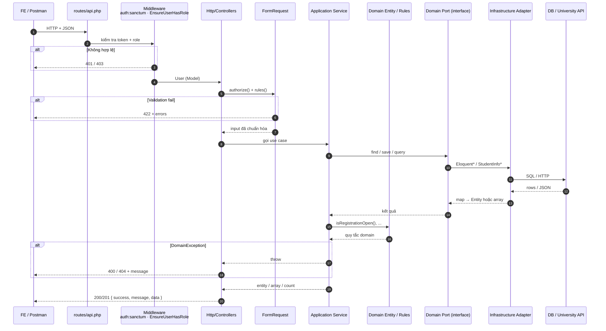

# Luồng request Hexagonal (tổng quát)

Áp dụng cho mọi endpoint trong `routes/api.php`.

```mermaid
sequenceDiagram
  autonumber
  participant Client as FE / Postman
  participant Route as routes/api.php
  participant MW as Middleware<br/>auth:sanctum · EnsureUserHasRole
  participant Ctrl as Http/Controllers
  participant Req as FormRequest
  participant Svc as Application Service
  participant Ent as Domain Entity / Rules
  participant Port as Domain Port (interface)
  participant Infra as Infrastructure Adapter
  participant Out as DB / University API

  Client->>Route: HTTP + JSON
  Route->>MW: kiểm tra token + role
  alt Không hợp lệ
    MW-->>Client: 401 / 403
  end
  MW->>Ctrl: User (Model)
  Ctrl->>Req: authorize() + rules()
  alt Validation fail
    Req-->>Client: 422 + errors
  end
  Req-->>Ctrl: input đã chuẩn hóa
  Ctrl->>Svc: gọi use case
  Svc->>Port: find / save / query
  Port->>Infra: Eloquent* / StudentInfo*
  Infra->>Out: SQL / HTTP
  Out-->>Infra: rows / JSON
  Infra-->>Port: map → Entity hoặc array
  Port-->>Svc: kết quả
  Svc->>Ent: isRegistrationOpen(), ...
  Ent-->>Svc: quy tắc domain
  alt DomainException
    Svc-->>Ctrl: throw
    Ctrl-->>Client: 400 / 404 + message
  end
  Svc-->>Ctrl: entity / array / count
  Ctrl-->>Client: 200/201 { success, message, data }
```
