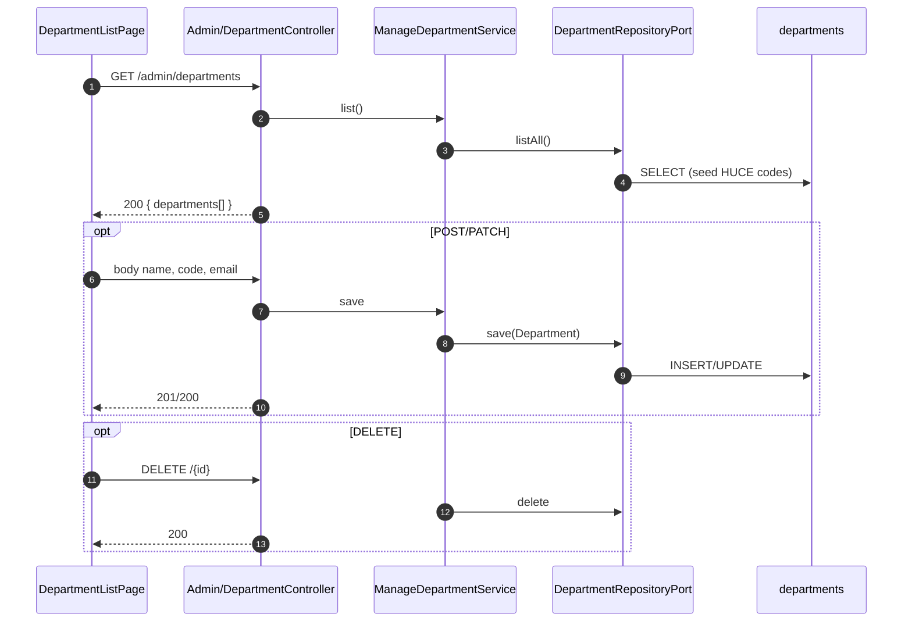

# Admin quản lý bộ môn

**API:** `GET/POST/PATCH/DELETE /api/admin/departments`  
**FE:** `DepartmentListPage`

```mermaid
sequenceDiagram
  autonumber
  participant FE as DepartmentListPage
  participant Ctrl as Admin/DepartmentController
  participant Svc as ManageDepartmentService
  participant DeptPort as DepartmentRepositoryPort
  participant DB as departments

  FE->>Ctrl: GET /admin/departments
  Ctrl->>Svc: list()
  Svc->>DeptPort: listAll()
  DeptPort->>DB: SELECT (seed HUCE codes)
  Ctrl-->>FE: 200 { departments[] }

  opt POST/PATCH
    FE->>Ctrl: body name, code, email
    Ctrl->>Svc: save
    Svc->>DeptPort: save(Department)
    DeptPort->>DB: INSERT/UPDATE
    Ctrl-->>FE: 201/200
  end

  opt DELETE
    FE->>Ctrl: DELETE /{id}
    Svc->>DeptPort: delete
    Ctrl-->>FE: 200
  end
```
