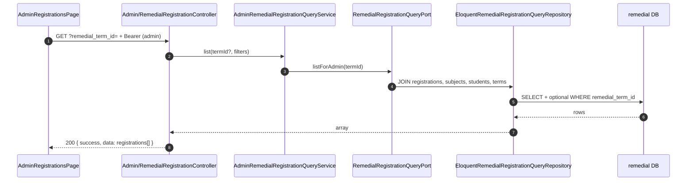

# Admin tra cứu đăng ký phụ đạo

**API:** `GET /api/admin/remedial-registrations?remedial_term_id=`  
**FE:** `AdminRegistrationsPage`

```mermaid
sequenceDiagram
  autonumber
  participant FE as AdminRegistrationsPage
  participant Ctrl as Admin/RemedialRegistrationController
  participant QuerySvc as AdminRemedialRegistrationQueryService
  participant QueryPort as RemedialRegistrationQueryPort
  participant Eloquent as EloquentRemedialRegistrationQueryRepository
  participant DB as remedial DB

  FE->>Ctrl: GET ?remedial_term_id= + Bearer (admin)
  Ctrl->>QuerySvc: list(termId?, filters)
  QuerySvc->>QueryPort: listForAdmin(termId)
  QueryPort->>Eloquent: JOIN registrations, subjects, students, terms
  Eloquent->>DB: SELECT + optional WHERE remedial_term_id
  DB-->>Eloquent: rows
  Eloquent-->>Ctrl: array
  Ctrl-->>FE: 200 { success, data: registrations[] }
```
