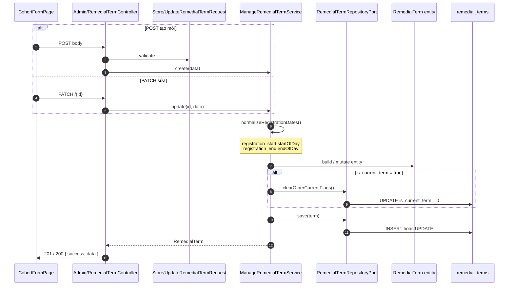

# Admin tạo / sửa đợt phụ đạo

**API:** `POST /api/admin/remedial-terms`, `PATCH /api/admin/remedial-terms/{id}`  
**FE:** `CohortFormPage`

```mermaid
sequenceDiagram
  autonumber
  participant FE as CohortFormPage
  participant Ctrl as Admin/RemedialTermController
  participant Req as Store/UpdateRemedialTermRequest
  participant Svc as ManageRemedialTermService
  participant TermPort as RemedialTermRepositoryPort
  participant Ent as RemedialTerm entity
  participant DB as remedial_terms

  alt POST tạo mới
    FE->>Ctrl: POST body
    Ctrl->>Req: validate
    Ctrl->>Svc: create(data)
  else PATCH sửa
    FE->>Ctrl: PATCH /{id}
    Ctrl->>Svc: update(id, data)
  end

  Svc->>Svc: normalizeRegistrationDates()
  Note over Svc: registration_start startOfDay<br/>registration_end endOfDay
  Svc->>Ent: build / mutate entity
  alt is_current_term = true
    Svc->>TermPort: clearOtherCurrentFlags()
    TermPort->>DB: UPDATE is_current_term = 0
  end
  Svc->>TermPort: save(term)
  TermPort->>DB: INSERT hoặc UPDATE
  Svc-->>Ctrl: RemedialTerm
  Ctrl-->>FE: 201 / 200 { success, data }
```
