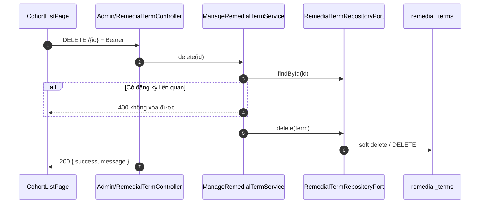

# Admin xóa đợt phụ đạo

**API:** `DELETE /api/admin/remedial-terms/{id}`  
**FE:** `CohortListPage`

```mermaid
sequenceDiagram
  autonumber
  participant FE as CohortListPage
  participant Ctrl as Admin/RemedialTermController
  participant Svc as ManageRemedialTermService
  participant TermPort as RemedialTermRepositoryPort
  participant DB as remedial_terms

  FE->>Ctrl: DELETE /{id} + Bearer
  Ctrl->>Svc: delete(id)
  Svc->>TermPort: findById(id)
  alt Có đăng ký liên quan
    Svc-->>FE: 400 không xóa được
  end
  Svc->>TermPort: delete(term)
  TermPort->>DB: soft delete / DELETE
  Ctrl-->>FE: 200 { success, message }
```
