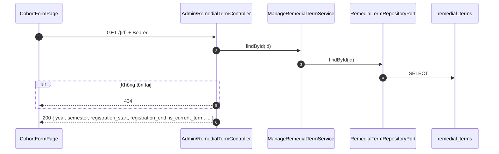

# Admin chi tiết một đợt phụ đạo

**API:** `GET /api/admin/remedial-terms/{id}`  
**FE:** `CohortFormPage`

```mermaid
sequenceDiagram
  autonumber
  participant FE as CohortFormPage
  participant Ctrl as Admin/RemedialTermController
  participant Svc as ManageRemedialTermService
  participant TermPort as RemedialTermRepositoryPort
  participant DB as remedial_terms

  FE->>Ctrl: GET /{id} + Bearer
  Ctrl->>Svc: findById(id)
  Svc->>TermPort: findById(id)
  TermPort->>DB: SELECT
  alt Không tồn tại
    Ctrl-->>FE: 404
  end
  Ctrl-->>FE: 200 { year, semester, registration_start, registration_end, is_current_term, ... }
```
