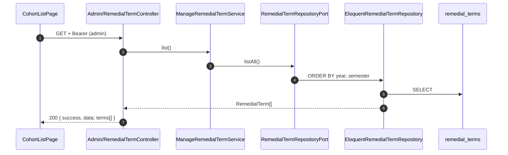

# Admin danh sách đợt phụ đạo

**API:** `GET /api/admin/remedial-terms`  
**FE:** `CohortListPage`, filter `AdminRegistrationsPage`

```mermaid
sequenceDiagram
  autonumber
  participant FE as CohortListPage
  participant Ctrl as Admin/RemedialTermController
  participant Svc as ManageRemedialTermService
  participant TermPort as RemedialTermRepositoryPort
  participant Eloquent as EloquentRemedialTermRepository
  participant DB as remedial_terms

  FE->>Ctrl: GET + Bearer (admin)
  Ctrl->>Svc: list()
  Svc->>TermPort: listAll()
  TermPort->>Eloquent: ORDER BY year, semester
  Eloquent->>DB: SELECT
  Eloquent-->>Ctrl: RemedialTerm[]
  Ctrl-->>FE: 200 { success, data: terms[] }
```
