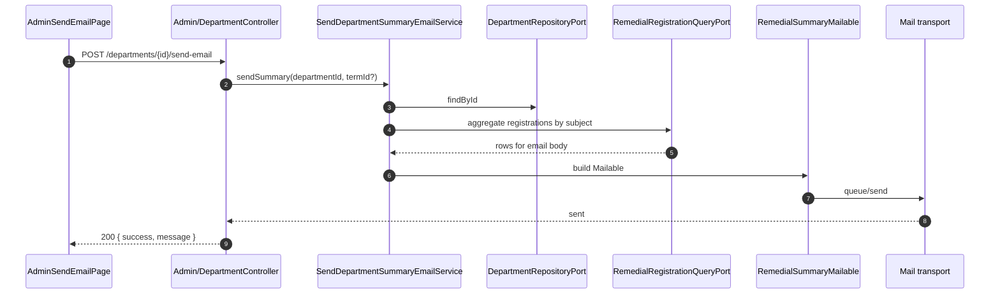

# Admin gửi email tổng hợp cho bộ môn

**API:** `POST /api/admin/departments/{id}/send-email`  
**FE:** `AdminSendEmailPage`

```mermaid
sequenceDiagram
  autonumber
  participant FE as AdminSendEmailPage
  participant Ctrl as Admin/DepartmentController
  participant Svc as SendDepartmentSummaryEmailService
  participant DeptPort as DepartmentRepositoryPort
  participant QueryPort as RemedialRegistrationQueryPort
  participant Mail as RemedialSummaryMailable
  participant SMTP as Mail transport

  FE->>Ctrl: POST /departments/{id}/send-email
  Ctrl->>Svc: sendSummary(departmentId, termId?)
  Svc->>DeptPort: findById
  Svc->>QueryPort: aggregate registrations by subject
  QueryPort-->>Svc: rows for email body
  Svc->>Mail: build Mailable
  Mail->>SMTP: queue/send
  SMTP-->>Ctrl: sent
  Ctrl-->>FE: 200 { success, message }
```
