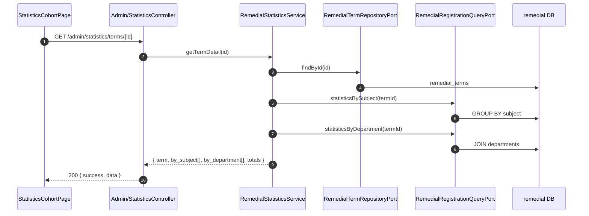

# Admin thống kê chi tiết một đợt

**API:** `GET /api/admin/statistics/terms/{id}`  
**FE:** `AdminDashboardPage`, `StatisticsCohortPage`

```mermaid
sequenceDiagram
  autonumber
  participant FE as StatisticsCohortPage
  participant Ctrl as Admin/StatisticsController
  participant Svc as RemedialStatisticsService
  participant TermPort as RemedialTermRepositoryPort
  participant QueryPort as RemedialRegistrationQueryPort
  participant DB as remedial DB

  FE->>Ctrl: GET /admin/statistics/terms/{id}
  Ctrl->>Svc: getTermDetail(id)
  Svc->>TermPort: findById(id)
  TermPort->>DB: remedial_terms
  Svc->>QueryPort: statisticsBySubject(termId)
  QueryPort->>DB: GROUP BY subject
  Svc->>QueryPort: statisticsByDepartment(termId)
  QueryPort->>DB: JOIN departments
  Svc-->>Ctrl: { term, by_subject[], by_department[], totals }
  Ctrl-->>FE: 200 { success, data }
```
