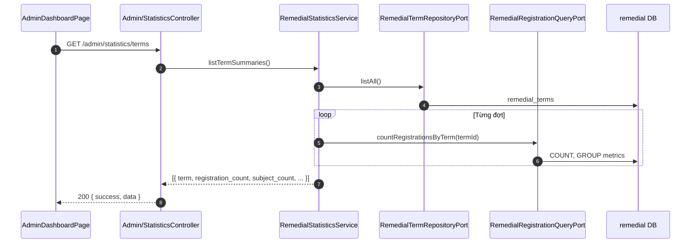

# Admin thống kê theo đợt (danh sách)

**API:** `GET /api/admin/statistics/terms`  
**FE:** `AdminDashboardPage`, `StatisticsCohortPage`

```mermaid
sequenceDiagram
  autonumber
  participant FE as AdminDashboardPage
  participant Ctrl as Admin/StatisticsController
  participant Svc as RemedialStatisticsService
  participant TermPort as RemedialTermRepositoryPort
  participant QueryPort as RemedialRegistrationQueryPort
  participant DB as remedial DB

  FE->>Ctrl: GET /admin/statistics/terms
  Ctrl->>Svc: listTermSummaries()
  Svc->>TermPort: listAll()
  TermPort->>DB: remedial_terms
  loop Từng đợt
    Svc->>QueryPort: countRegistrationsByTerm(termId)
    QueryPort->>DB: COUNT, GROUP metrics
  end
  Svc-->>Ctrl: [{ term, registration_count, subject_count, ... }]
  Ctrl-->>FE: 200 { success, data }
```
