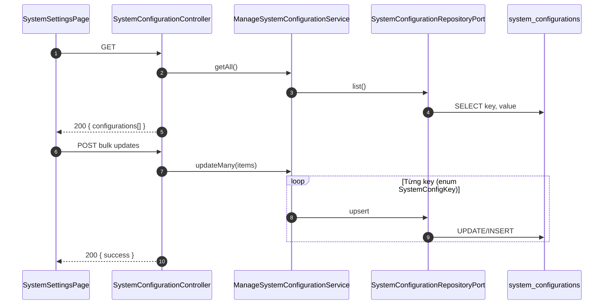

# Admin cấu hình hệ thống

**API:** `GET /api/admin/system-configurations`, `POST /api/admin/system-configurations`  
**FE:** `SystemSettingsPage`

```mermaid
sequenceDiagram
  autonumber
  participant FE as SystemSettingsPage
  participant Ctrl as SystemConfigurationController
  participant Svc as ManageSystemConfigurationService
  participant ConfigPort as SystemConfigurationRepositoryPort
  participant DB as system_configurations

  FE->>Ctrl: GET
  Ctrl->>Svc: getAll()
  Svc->>ConfigPort: list()
  ConfigPort->>DB: SELECT key, value
  Ctrl-->>FE: 200 { configurations[] }

  FE->>Ctrl: POST bulk updates
  Ctrl->>Svc: updateMany(items)
  loop Từng key (enum SystemConfigKey)
    Svc->>ConfigPort: upsert
    ConfigPort->>DB: UPDATE/INSERT
  end
  Ctrl-->>FE: 200 { success }
```
