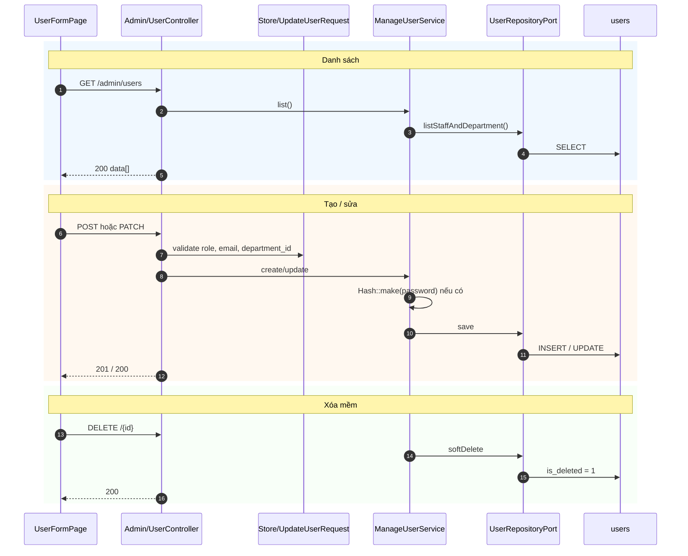

# Admin quản lý user

**API:** `GET/POST /admin/users`, `GET/PATCH/DELETE /admin/users/{id}`  
**FE:** `UserListPage`, `UserFormPage`

```mermaid
sequenceDiagram
  autonumber
  participant FE as UserFormPage
  participant Ctrl as Admin/UserController
  participant Req as Store/UpdateUserRequest
  participant Svc as ManageUserService
  participant UserPort as UserRepositoryPort
  participant DB as users

  rect rgb(240,248,255)
    Note over FE,DB: Danh sách
    FE->>Ctrl: GET /admin/users
    Ctrl->>Svc: list()
    Svc->>UserPort: listStaffAndDepartment()
    UserPort->>DB: SELECT
    Ctrl-->>FE: 200 data[]
  end

  rect rgb(255,248,240)
    Note over FE,DB: Tạo / sửa
    FE->>Ctrl: POST hoặc PATCH
    Ctrl->>Req: validate role, email, department_id
    Ctrl->>Svc: create/update
    Svc->>Svc: Hash::make(password) nếu có
    Svc->>UserPort: save
    UserPort->>DB: INSERT / UPDATE
    Ctrl-->>FE: 201 / 200
  end

  rect rgb(248,255,248)
    Note over FE,DB: Xóa mềm
    FE->>Ctrl: DELETE /{id}
    Svc->>UserPort: softDelete
    UserPort->>DB: is_deleted = 1
    Ctrl-->>FE: 200
  end
```
