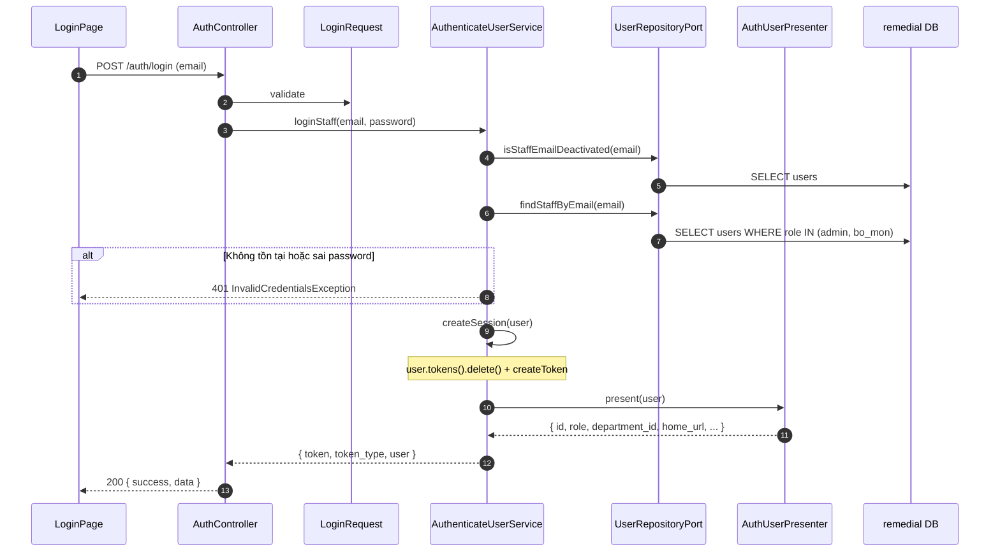

# Đăng nhập Admin / Bộ môn

**API:** `POST /api/auth/login`  
**Body:** `{ "email": "admin@...", "password": "..." }`  
**FE:** `LoginPage`

```mermaid
sequenceDiagram
  autonumber
  participant FE as LoginPage
  participant Auth as AuthController
  participant Req as LoginRequest
  participant AuthSvc as AuthenticateUserService
  participant UserPort as UserRepositoryPort
  participant Presenter as AuthUserPresenter
  participant DB as remedial DB

  FE->>Auth: POST /auth/login (email)
  Auth->>Req: validate
  Auth->>AuthSvc: loginStaff(email, password)

  AuthSvc->>UserPort: isStaffEmailDeactivated(email)
  UserPort->>DB: SELECT users
  AuthSvc->>UserPort: findStaffByEmail(email)
  UserPort->>DB: SELECT users WHERE role IN (admin, bo_mon)
  alt Không tồn tại hoặc sai password
    AuthSvc-->>FE: 401 InvalidCredentialsException
  end

  AuthSvc->>AuthSvc: createSession(user)
  Note over AuthSvc: user.tokens().delete() + createToken
  AuthSvc->>Presenter: present(user)
  Presenter-->>AuthSvc: { id, role, department_id, home_url, ... }
  AuthSvc-->>Auth: { token, token_type, user }
  Auth-->>FE: 200 { success, data }
```
