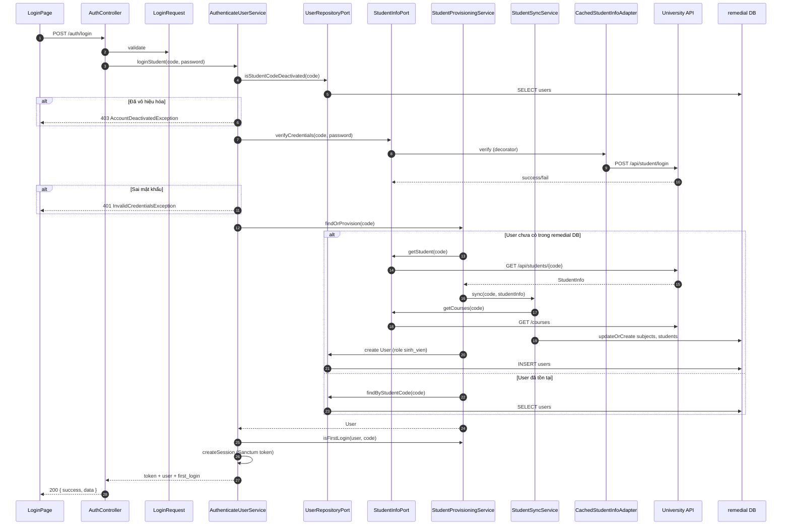

# Đăng nhập sinh viên (+ auto-provision lần đầu)

**API:** `POST /api/auth/login`  
**Body:** `{ "student_code": "SV001", "password": "..." }`  
**FE:** `LoginPage`, `AuthContext`

```mermaid
sequenceDiagram
  autonumber
  participant FE as LoginPage
  participant Auth as AuthController
  participant Req as LoginRequest
  participant AuthSvc as AuthenticateUserService
  participant UserPort as UserRepositoryPort
  participant StuPort as StudentInfoPort
  participant Prov as StudentProvisioningService
  participant Sync as StudentSyncService
  participant Uni as CachedStudentInfoAdapter
  participant UniAPI as University API
  participant DB as remedial DB

  FE->>Auth: POST /auth/login
  Auth->>Req: validate
  Auth->>AuthSvc: loginStudent(code, password)

  AuthSvc->>UserPort: isStudentCodeDeactivated(code)
  UserPort->>DB: SELECT users
  alt Đã vô hiệu hóa
    AuthSvc-->>FE: 403 AccountDeactivatedException
  end

  AuthSvc->>StuPort: verifyCredentials(code, password)
  StuPort->>Uni: verify (decorator)
  Uni->>UniAPI: POST /api/student/login
  UniAPI-->>StuPort: success/fail
  alt Sai mật khẩu
    AuthSvc-->>FE: 401 InvalidCredentialsException
  end

  AuthSvc->>Prov: findOrProvision(code)
  alt User chưa có trong remedial DB
    Prov->>StuPort: getStudent(code)
    StuPort->>UniAPI: GET /api/students/{code}
    UniAPI-->>Prov: StudentInfo
    Prov->>Sync: sync(code, studentInfo)
    Sync->>StuPort: getCourses(code)
    StuPort->>UniAPI: GET /courses
    Sync->>DB: updateOrCreate subjects, students
    Prov->>UserPort: create User (role sinh_vien)
    UserPort->>DB: INSERT users
  else User đã tồn tại
    Prov->>UserPort: findByStudentCode(code)
    UserPort->>DB: SELECT users
  end
  Prov-->>AuthSvc: User

  AuthSvc->>Prov: isFirstLogin(user, code)
  AuthSvc->>AuthSvc: createSession (Sanctum token)
  AuthSvc-->>Auth: token + user + first_login
  Auth-->>FE: 200 { success, data }
```
