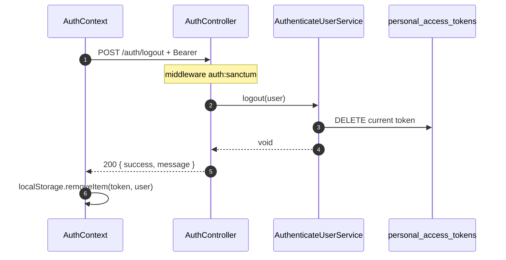

# Đăng xuất

**API:** `POST /api/auth/logout`  
**FE:** `AuthContext`

```mermaid
sequenceDiagram
  autonumber
  participant FE as AuthContext
  participant Auth as AuthController
  participant AuthSvc as AuthenticateUserService
  participant DB as personal_access_tokens

  FE->>Auth: POST /auth/logout + Bearer
  Note over Auth: middleware auth:sanctum
  Auth->>AuthSvc: logout(user)
  AuthSvc->>DB: DELETE current token
  AuthSvc-->>Auth: void
  Auth-->>FE: 200 { success, message }
  FE->>FE: localStorage.removeItem(token, user)
```
