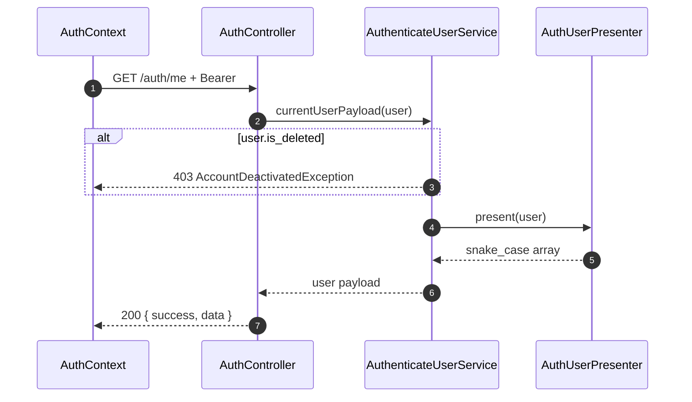

# Lấy thông tin user hiện tại

**API:** `GET /api/auth/me`  
**FE:** `AuthContext` (refresh sau F5)

```mermaid
sequenceDiagram
  autonumber
  participant FE as AuthContext
  participant Auth as AuthController
  participant AuthSvc as AuthenticateUserService
  participant Presenter as AuthUserPresenter

  FE->>Auth: GET /auth/me + Bearer
  Auth->>AuthSvc: currentUserPayload(user)
  alt user.is_deleted
    AuthSvc-->>FE: 403 AccountDeactivatedException
  end
  AuthSvc->>Presenter: present(user)
  Presenter-->>AuthSvc: snake_case array
  AuthSvc-->>Auth: user payload
  Auth-->>FE: 200 { success, data }
```
