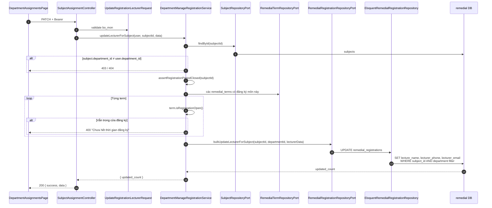

# Gán giảng viên phụ đạo theo môn (bulk)

**API:** `PATCH /api/department/subjects/{subjectId}/lecturer`  
**Body:** `{ "lecture_name", "lecturer_phone_number", "lecturer_email" }`  
**FE:** `DepartmentAssignmentsPage` (modal)

