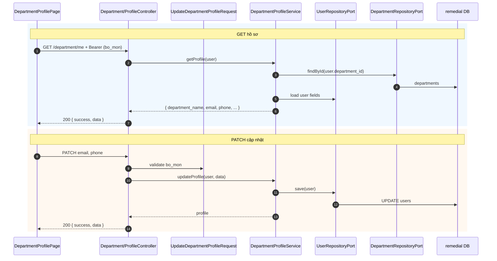

# Hồ sơ bộ môn

**API:** `GET /api/department/me`, `PATCH /api/department/me`  
**FE:** `DepartmentProfilePage`

```mermaid
sequenceDiagram
  autonumber
  participant FE as DepartmentProfilePage
  participant Ctrl as Department/ProfileController
  participant Req as UpdateDepartmentProfileRequest
  participant Svc as DepartmentProfileService
  participant UserPort as UserRepositoryPort
  participant DeptPort as DepartmentRepositoryPort
  participant DB as remedial DB

  rect rgb(240,248,255)
    Note over FE,DB: GET hồ sơ
    FE->>Ctrl: GET /department/me + Bearer (bo_mon)
    Ctrl->>Svc: getProfile(user)
    Svc->>DeptPort: findById(user.department_id)
    DeptPort->>DB: departments
    Svc->>UserPort: load user fields
    Svc-->>Ctrl: { department_name, email, phone, ... }
    Ctrl-->>FE: 200 { success, data }
  end

  rect rgb(255,248,240)
    Note over FE,DB: PATCH cập nhật
    FE->>Ctrl: PATCH email, phone
    Ctrl->>Req: validate bo_mon
    Ctrl->>Svc: updateProfile(user, data)
    Svc->>UserPort: save(user)
    UserPort->>DB: UPDATE users
    Svc-->>Ctrl: profile
    Ctrl-->>FE: 200 { success, data }
  end
```
