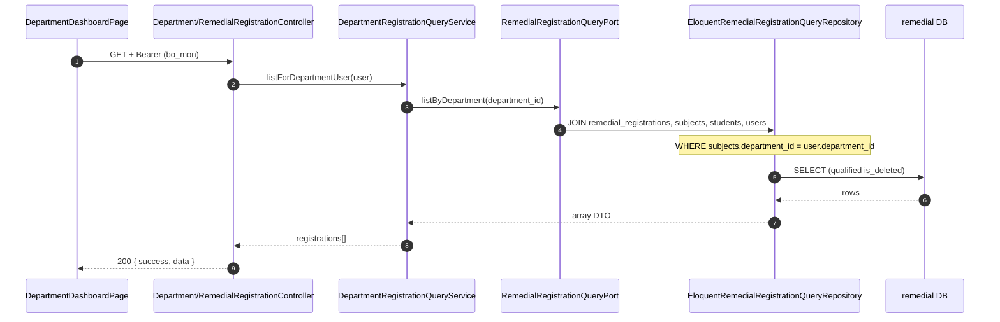

# Danh sách đăng ký phụ đạo (chi tiết theo sinh viên)

**API:** `GET /api/department/remedial-registrations`  
**FE:** `DepartmentDashboardPage`

```mermaid
sequenceDiagram
  autonumber
  participant FE as DepartmentDashboardPage
  participant Ctrl as Department/RemedialRegistrationController
  participant QuerySvc as DepartmentRegistrationQueryService
  participant QueryPort as RemedialRegistrationQueryPort
  participant Eloquent as EloquentRemedialRegistrationQueryRepository
  participant DB as remedial DB

  FE->>Ctrl: GET + Bearer (bo_mon)
  Ctrl->>QuerySvc: listForDepartmentUser(user)
  QuerySvc->>QueryPort: listByDepartment(department_id)
  QueryPort->>Eloquent: JOIN remedial_registrations, subjects, students, users
  Note over Eloquent: WHERE subjects.department_id = user.department_id
  Eloquent->>DB: SELECT (qualified is_deleted)
  DB-->>Eloquent: rows
  Eloquent-->>QuerySvc: array DTO
  QuerySvc-->>Ctrl: registrations[]
  Ctrl-->>FE: 200 { success, data }
```
