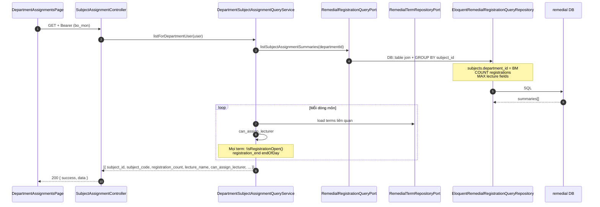

# Danh sách phân công theo môn (group by subject)

**API:** `GET /api/department/subject-assignments`  
**FE:** `DepartmentAssignmentsPage`

```mermaid
sequenceDiagram
  autonumber
  participant FE as DepartmentAssignmentsPage
  participant Ctrl as SubjectAssignmentController
  participant QuerySvc as DepartmentSubjectAssignmentQueryService
  participant QueryPort as RemedialRegistrationQueryPort
  participant TermPort as RemedialTermRepositoryPort
  participant Eloquent as EloquentRemedialRegistrationQueryRepository
  participant DB as remedial DB

  FE->>Ctrl: GET + Bearer (bo_mon)
  Ctrl->>QuerySvc: listForDepartmentUser(user)

  QuerySvc->>QueryPort: listSubjectAssignmentSummaries(departmentId)
  QueryPort->>Eloquent: DB::table join + GROUP BY subject_id
  Note over Eloquent: subjects.department_id = BM<br/>COUNT registrations<br/>MAX lecture fields
  Eloquent->>DB: SQL
  DB-->>Eloquent: summaries[]

  loop Mỗi dòng môn
    QuerySvc->>TermPort: load terms liên quan
    QuerySvc->>QuerySvc: can_assign_lecturer
    Note over QuerySvc: Mọi term: !isRegistrationOpen()<br/>registration_end endOfDay
  end

  QuerySvc-->>Ctrl: [{ subject_id, subject_code, registration_count, lecture_name, can_assign_lecturer, ... }]
  Ctrl-->>FE: 200 { success, data }
```
