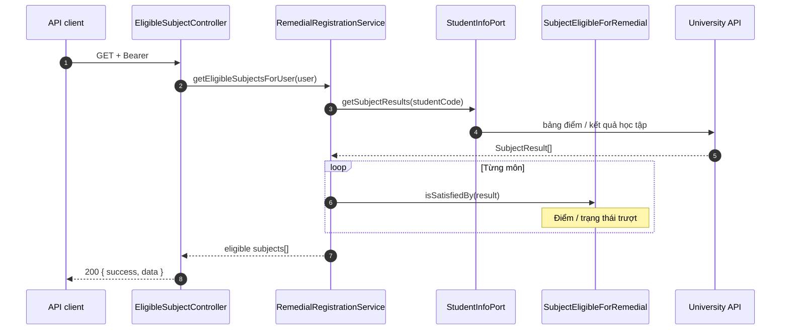

# Môn đủ điều kiện phụ đạo (trượt — legacy)

**API:** `GET /api/student/me/eligible-subjects`  
**FE:** *(không dùng — FE đăng ký qua `term-registered-subjects`)*

```mermaid
sequenceDiagram
  autonumber
  participant Client as API client
  participant Ctrl as EligibleSubjectController
  participant RegSvc as RemedialRegistrationService
  participant StuPort as StudentInfoPort
  participant Spec as SubjectEligibleForRemedial
  participant Uni as University API

  Client->>Ctrl: GET + Bearer
  Ctrl->>RegSvc: getEligibleSubjectsForUser(user)
  RegSvc->>StuPort: getSubjectResults(studentCode)
  StuPort->>Uni: bảng điểm / kết quả học tập
  Uni-->>RegSvc: SubjectResult[]
  loop Từng môn
    RegSvc->>Spec: isSatisfiedBy(result)
    Note over Spec: Điểm / trạng thái trượt
  end
  RegSvc-->>Ctrl: eligible subjects[]
  Ctrl-->>Client: 200 { success, data }
```
