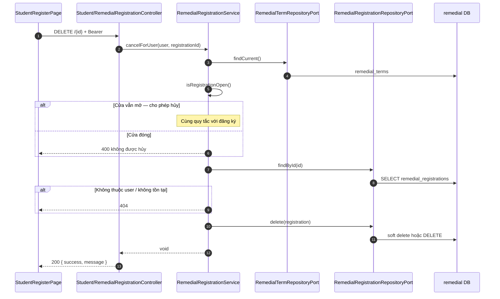

# Hủy đăng ký phụ đạo

**API:** `DELETE /api/student/me/remedial-registrations/{id}`  
**FE:** `StudentRegisterPage`, `StudentRegistrationsPage`

```mermaid
sequenceDiagram
  autonumber
  participant FE as StudentRegisterPage
  participant Ctrl as Student/RemedialRegistrationController
  participant RegSvc as RemedialRegistrationService
  participant TermPort as RemedialTermRepositoryPort
  participant RegPort as RemedialRegistrationRepositoryPort
  participant DB as remedial DB

  FE->>Ctrl: DELETE /{id} + Bearer
  Ctrl->>RegSvc: cancelForUser(user, registrationId)

  RegSvc->>TermPort: findCurrent()
  TermPort->>DB: remedial_terms
  RegSvc->>RegSvc: isRegistrationOpen()
  alt Cửa vẫn mở — cho phép hủy
    Note over RegSvc: Cùng quy tắc với đăng ký
  else Cửa đóng
    RegSvc-->>FE: 400 không được hủy
  end

  RegSvc->>RegPort: findById(id)
  RegPort->>DB: SELECT remedial_registrations
  alt Không thuộc user / không tồn tại
    RegSvc-->>FE: 404
  end
  RegSvc->>RegPort: delete(registration)
  RegPort->>DB: soft delete hoặc DELETE
  RegSvc-->>Ctrl: void
  Ctrl-->>FE: 200 { success, message }
```
