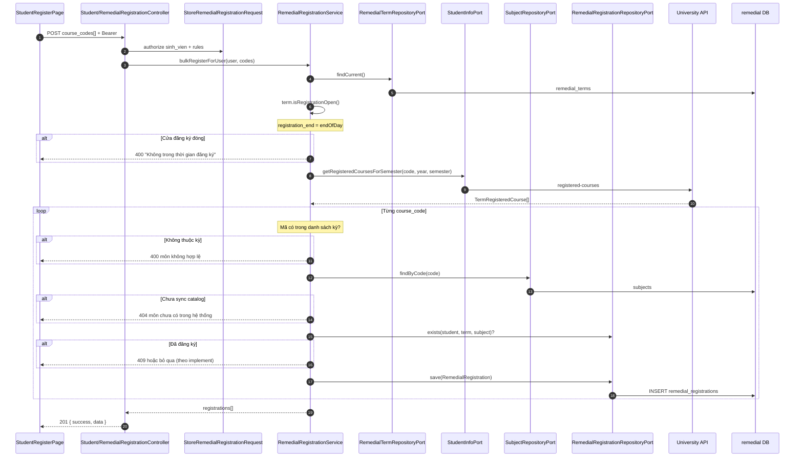

# Đăng ký phụ đạo (một hoặc nhiều môn)

**API:** `POST /api/student/me/remedial-registrations`  
**Body:** `{ "course_codes": ["CS101", "MATH201"] }` hoặc `{ "course_code": "CS101" }`  
**FE:** `StudentRegisterPage`

