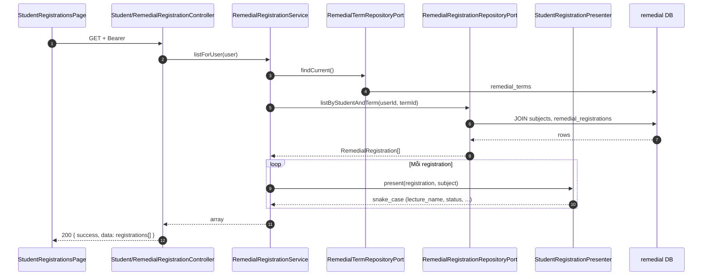

# Danh sách đăng ký phụ đạo của sinh viên

**API:** `GET /api/student/me/remedial-registrations`  
**FE:** `StudentRegisterPage`, `StudentRegistrationsPage`, `StudentInstructorsPage`, `StudentDashboardPage`

