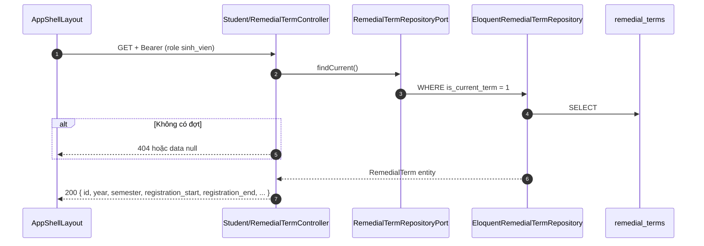

# Đợt phụ đạo hiện tại (sinh viên)

**API:** `GET /api/student/remedial-terms/current`  
**FE:** `AppShellLayout`, `StudentDashboardPage`

```mermaid
sequenceDiagram
  autonumber
  participant FE as AppShellLayout
  participant Ctrl as Student/RemedialTermController
  participant TermPort as RemedialTermRepositoryPort
  participant Eloquent as EloquentRemedialTermRepository
  participant DB as remedial_terms

  FE->>Ctrl: GET + Bearer (role sinh_vien)
  Ctrl->>TermPort: findCurrent()
  TermPort->>Eloquent: WHERE is_current_term = 1
  Eloquent->>DB: SELECT
  alt Không có đợt
    Ctrl-->>FE: 404 hoặc data null
  end
  Eloquent-->>Ctrl: RemedialTerm entity
  Ctrl-->>FE: 200 { id, year, semester, registration_start, registration_end, ... }
```
