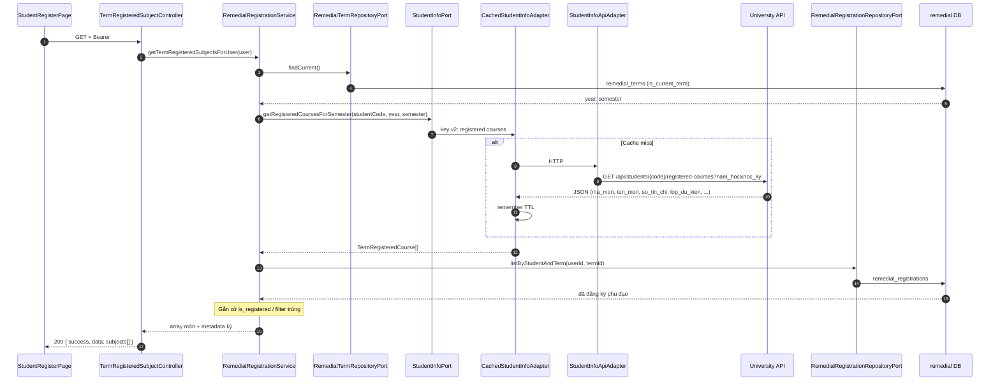

# Môn đã đăng ký chính quy theo kỳ (University)

**API:** `GET /api/student/me/term-registered-subjects`  
**FE:** `StudentRegisterPage` (danh sách chọn môn phụ đạo)

```mermaid
sequenceDiagram
  autonumber
  participant FE as StudentRegisterPage
  participant Ctrl as TermRegisteredSubjectController
  participant RegSvc as RemedialRegistrationService
  participant TermPort as RemedialTermRepositoryPort
  participant StuPort as StudentInfoPort
  participant Cache as CachedStudentInfoAdapter
  participant Uni as StudentInfoApiAdapter
  participant UniAPI as University API
  participant RegPort as RemedialRegistrationRepositoryPort
  participant DB as remedial DB

  FE->>Ctrl: GET + Bearer
  Ctrl->>RegSvc: getTermRegisteredSubjectsForUser(user)

  RegSvc->>TermPort: findCurrent()
  TermPort->>DB: remedial_terms (is_current_term)
  DB-->>RegSvc: year, semester

  RegSvc->>StuPort: getRegisteredCoursesForSemester(studentCode, year, semester)
  StuPort->>Cache: key v2: registered courses
  alt Cache miss
    Cache->>Uni: HTTP
    Uni->>UniAPI: GET /api/students/{code}/registered-courses?nam_hoc&hoc_ky
    UniAPI-->>Cache: JSON (ma_mon, ten_mon, so_tin_chi, lop_du_kien, ...)
    Cache->>Cache: remember TTL
  end
  Cache-->>RegSvc: TermRegisteredCourse[]

  RegSvc->>RegPort: listByStudentAndTerm(userId, termId)
  RegPort->>DB: remedial_registrations
  DB-->>RegSvc: đã đăng ký phụ đạo

  Note over RegSvc: Gắn cờ is_registered / filter trùng
  RegSvc-->>Ctrl: array môn + metadata kỳ
  Ctrl-->>FE: 200 { success, data: subjects[] }
```
